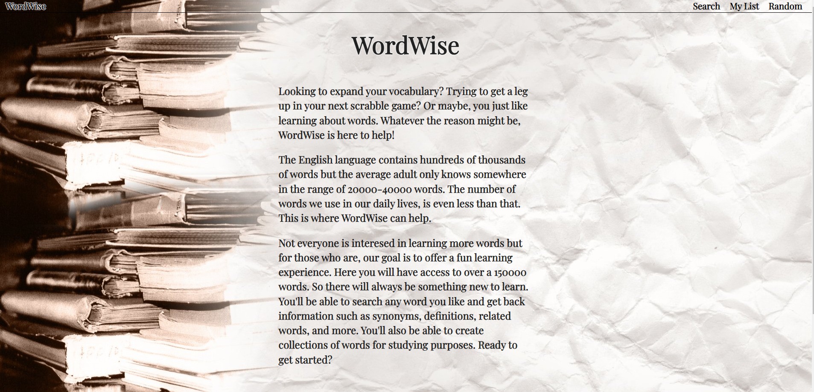

# Word-Wise
Full-stack MERN application that utilizies multiple API's to provide word related data such as definitions and synonyms.

## Screenshot



## Technologies Used
<ul>
<li>React</li>
<li>Mongoose</li>
<li>MongoDB</li>
<li>Express</li>
<li>Node.js</li>
<li>Semantic-Ui</li>
</ul>

## Installation Insturctions
<ul>
<li>Fork and clone this repo to your local machine</li>
<li>Open file with desired code editor</li>
<li>To install all necessary packages run</li>


```
npm i
``` 

<li>In root level of repo create a .env file and add the following variables</li>


```
PORT=3000
MONGODBURI=mongodb+srv://(yourUsername):(yourMongoDBConnectionString)
VITE_XRAPIDAPIKEY=ApiKeyForWordAPI
VITE_DICTIONARYKEY=ApiKeyForMerriamWebsterCollegiateDictionaryWithAudio
VITE_THESAURUSKEY=ApiKeyForMeriamWebsterCollegiateThesaurus
```

<li>This app uses free access API's that require keys. They can be obtained from https://dictionaryapi.com/ and https://rapidapi.com/dpventures/api/wordsapi</li>
<li>Open two terminals and run one of the following in each</li>


```
npm run backend
```


```
npm run frontend
```

<li>Navigate to localhost:5173 in your web browser and you now have access to all functionality of WordWise</li>
</ul>

## User Stories

As a word junkie, I want a place where I can look up all kinds of neat info about words, to learn and improve my vocabulary.

As a software developer, I want to see a well deigned app with DRY code to evaluate the engineers skill level.

As a classmate, I want to see cool apps so that I can congratulate them on how much they have improved!

## Wireframes

<ul>
<li>https://wireframe.cc/V7NTms</li>
<li>https://wireframe.cc/nU6J9Q</li>
<li>https://wireframe.cc/GTnyIo</li>
<li>https://wireframe.cc/Sn44aS</li>
</ul>

## Unsolved Problems


## Next Steps
<ul>
<li>Format the list page so that words are grouped by collections.</li>
<li>User auth</li>
<li>More detailed search results</li>
<li>Store word details for access in list or link words to their search</li>
</ul>
